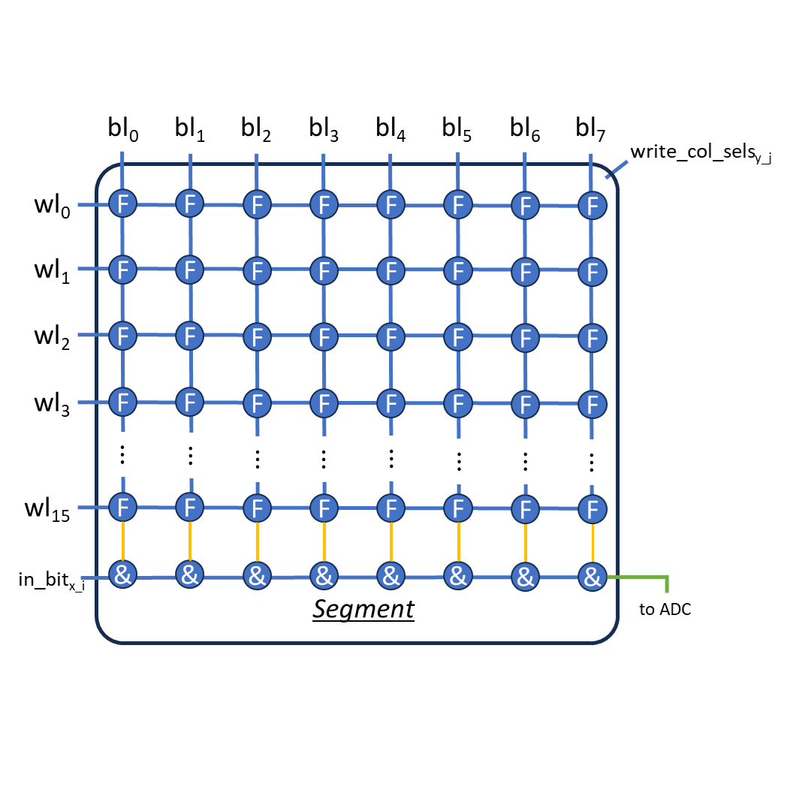
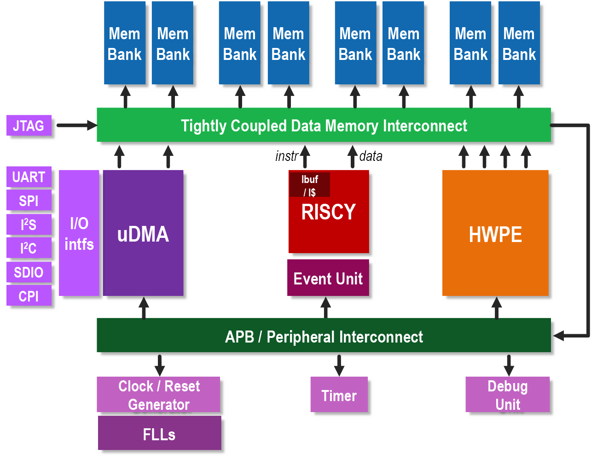
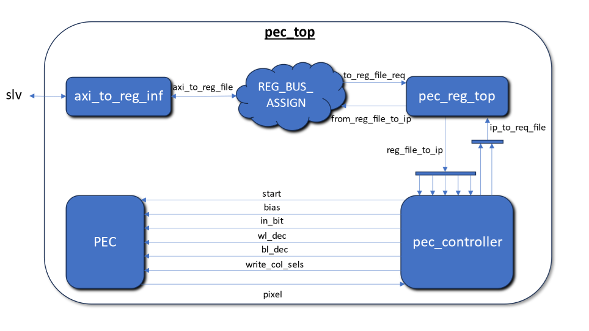
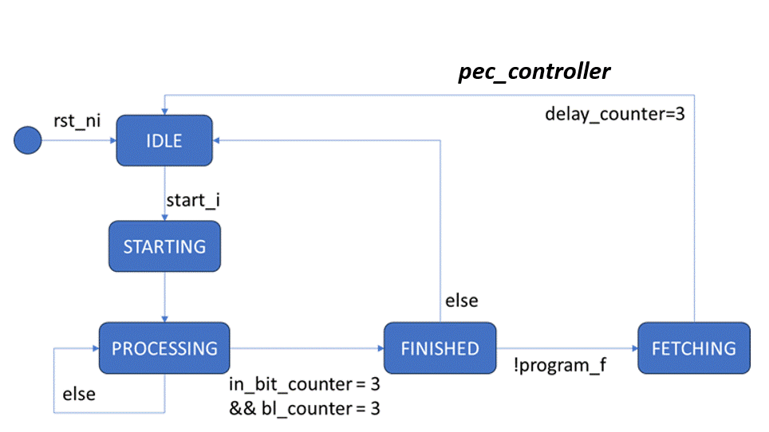
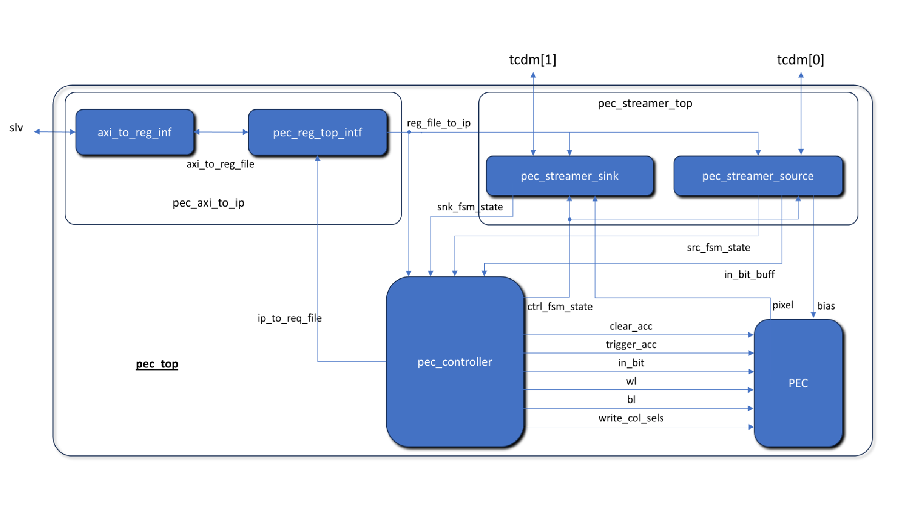
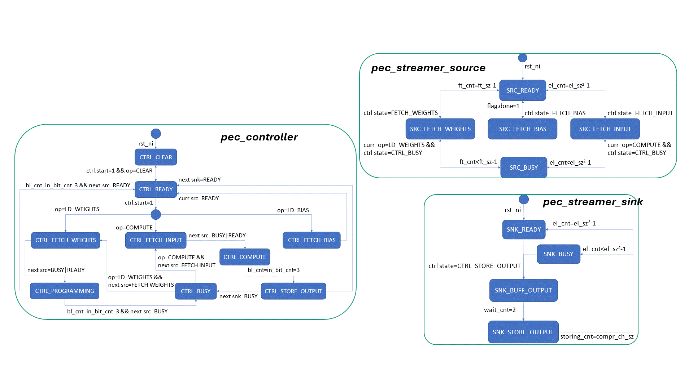

# <h1 align="center">In-Memory Accelerator Controller</h1>
### This repository contains the source files of my Master's Thesis for Electrical and Computer Engineering degree.

My thesis with the title "***Integration of an In-Memory Accelerator into a RISC-V Microcontroller for Edge Computing Applications***" can be found in this [link](https://ikee.lib.auth.gr/record/353424/?ln=en).

## Table of Contents
**[Introduction](#Introduction)** 
**[In-Memory Accelerator Architecture](#in-memory-accelerator-architecture)** 
**[PULPissimo Microcontroller](#pulpissimo-microcontroller)** 
**[Developed Controller Module](#developed-controller-module)** 
**[Verification and Simulation](#verification-and-simulation)** 
**[FPGA Implementation and Comparison](#fpga-implementation-and-comparison)** 
**[Conclusion and Future Work](#conclusion-and-future-work)** 
**[References](#references)** 

## Introduction
In-memory computing (IMC) is a novel approach that reduces CPU utilization and data transfer by performing computations directly in memory. This type of computing is beneficial for neural networks, where many simple operations execute in parallel. This project integrates an IMC accelerator with a RISC-V microcontroller, focusing on edge computing applications where low-power devices with embedded sensors process data locally

## In-Memory Accelerator Architecture
The used IMC performs bit-decomposed integer convolution operation, presented by the following formula.

$$
O(x,y,z) = \sum_{m=0}^{I_p-1}i_s
\left(
    \sum_{n=0}^{W_p-1}w_s
    \left(
        \sum_{i=0}^{k-1}\sum_{j=0}^{k-1}\sum_{h=0}^{c}
        \left[
            I_m(x+i,y+j,h) \land W_n(i,j,h)
        \right]
    \right)\ll (m+n)
\right)
$$

$$
i_s = \begin{cases}
1 & m < I_p-1 \\
-1 & m = I_p - 1
\end{cases} \text{and }
w_s= \begin{cases}
1 & n < W_p-1 \\
-1 & n = W_p - 1
\end{cases}
$$

Its architecture consists of the following components:
- Segment: A matrix of multiplexed memory cells that store weights of different layers.
- Processing Element (PE): A matrix of segments along with ADC and left-shift circuits to perform inference.
- PE Cluster: A cluster of processing elements along with adders and ReLU circuits that perform the post-processing functions (bias addition, activation function)
 

## PULPissimo Microcontroller

The microcontroller chosen for this task is the PULPissimo, part of the Parallel Ultra Low Power family, featuring a RISC-V processor at its core due to its:
- Highly Parameterized Architecture
- Support for Accelerator Integration
- Advanced Memory Subsystem
- Peripheral Support

Connecting an MCU with peripherals and integrating it with an accelerator provides flexibility and adaptability for neural network execution as an edge device.
 

## Developed Controller Module
### Version 1
The RISC-V core manages the accelerator using the developed control circuits. Those include:
- The circuits that convert the Advanced eXtensible Interface (AXI) into control signals and
- The "pec_controller" module that executes a state machine coordinating the inputs of the IMC on each clock cycle.

The state machine follows different flows depending on the desired operation. For 4-bit integer numbers, it can perform a programming operation, storing weights in the IMC or inference by supplying input bits and fetching the results.

| | |
|-|-|

### Version 2
An enhanced version of the controller module was introduced. This upgraded version compares with the previous by:
-  Adding data streamer modules: These are used for efficient data transfer between the RAM and the accelerator.
- Extending controller functionality: To handle complex operations in collaboration with streamer modules.

In precise terms, the "streamer source" circuit retrieves data from the memory, whereas the "streamer sink" is entrusted with storing data back to the memory. The FSM of the enhanced controller incorporates three primary flows, each executed based on the requested process initiated by the software. These are the IMC programming, the bias fetching, and the inference with input data.

| | |
|-|-|

## Verification and Simulation
The implementation's correctness verification happens with a developed testbench file. A quantized neural network was trained on a High-Performance Computing (HPC) system using the "QKeras" framework, and the trained weights, biases, and the network's output were exported and incorporated into the software running on the microcontroller's core.

The entire system underwent behavioral simulation to assess whether the implementation yields outputs comparable to those of the trained network running on the computer. The simulation was conducted in Questa Sim, utilizing the Wave viewer for debugging.

## FPGA Implementation and Comparison
The design was synthesized and implemented on FPGA boards, utilizing tools like Vivado for:
- Synthesis and Implementation
- Bitstream Generation
- Resource and Power Utilization Analysis

A file of design constraints was defined, and directives were provided to aid the processes of synthesis and implementation. Evaluating the utilization analysis, the second version of the implementation consumes more resources and dynamic power. However, the significant speed-up gained in CPU time during behavioral simulation outweighs the increased resource usage.

## Conclusion and Future Work
This project successfully integrated an in-memory accelerator into a RISC-V microcontroller, validated through simulation and FPGA implementation. Future work includes:
- Real-time testing on FPGA.
- Full neural network implementation.
- Additional hardware development for more advanced data processing.

## References
1. [P. D. Schiavone et al., "Quentin: an Ultra-Low-Power PULPissimo SoC in 22nm FDX"](https://doi.org/10.1109/S3S.2018.8640145)
2. [T. Soliman et al., "FELIX: A Ferroelectric FET Based Low Power Mixed-Signal In-Memory Architecture for DNN Acceleration"](https://doi.org/10.1145/3529760)
